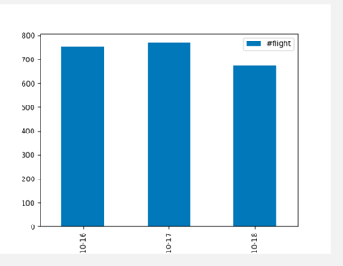
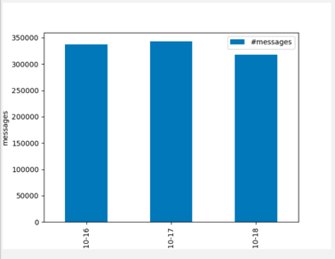
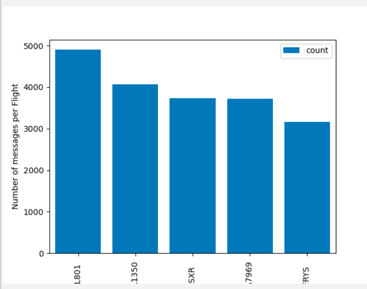
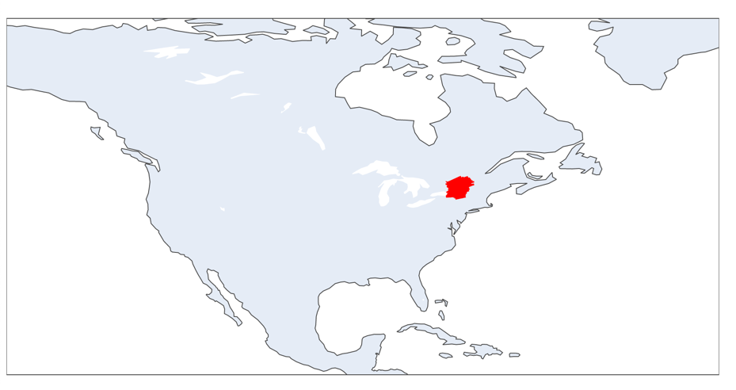

# IA646_FinalProject
 FinalProject

Project Summary: 
        
    Source files got the messages from the flights. Read JSON message from the source file and 
    manipluate the JSON data in the way the data can be ordered by datetime. After the data is ready
    for the consumption, try to do some data metrices and do the metrices visualization.

Project Implementation:
   
 1. Data Manipulation:
            
        Read the source data line by line, the source data has the datetime in the main json and the "payload" as the 
        inner json object that has the flight details. Source data is read line by line and manipulated in such
        a way that datetime and flight payload object are in single json object. After the message are converted to 
        json object, now the data is loaded into Panda Dataframe to the further data metrics and visuvalization.

 2. **Metric 1:** No of Flights by datetime
        
        Using the Panda Dataframe, data is grouped by the Date and the flight.
    

 3. **Metric 2:** No of Messages by datetime
        
        Using the Dataframe,data is grouped by message and date
    
 
 4. **Metric 3:** Top 5 flights by message count 
        
        Using the Dataframe, data grouped by count of message and flight for top 5 flights.
    
 
 6. **Metric 4** : Trace the Might Longitude and Latitude in the map
        
           Using Panda Dataframe, get the list of flights and then query the dataframe for the min / max 
           of the Longitude and Latitude of the flights. With the plotly module, tried to plot the Longitude and
           Latitude in the map.
       